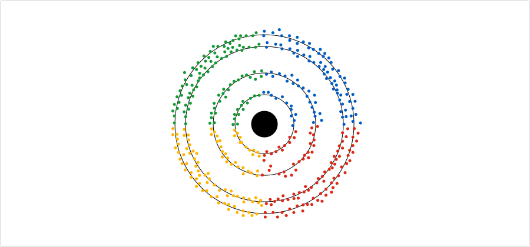

Dojo is the technology knowledge base of LKMX. Designed to organize and interpret the Software Engineering landscape, it is a central hub for learning, using, and progressing technology.

At its core, Dojo adopts a simplified model that identifies two critical attributes for each technology: its [[type]] and [[ring]].

The [[type]] categorizes technologies based on their functional role within our operational lifecycle, including design, development, and operation. This classification aids in contextualizing each technology within our broader technological environment, streamlining how we navigate and understand our tech landscape.

The [[ring]], inspired by the Technology Radar, denotes the maturity levels of various technologies alongside our organizational readiness to embrace and integrate them. This aspect simplifies our decision-making process, guiding us on whether to adopt, trial, evaluate, or hold off on implementing specific technologies.

In addition to these structural elements, Dojo emphasizes active, hands-on learning. We focus on real-world applications and problem-solving in technology, encouraging a culture of continuous learning and adaptation. This approach ensures that our team remains skilled and knowledgeable, ready to tackle the challenges of an ever-evolving industry.

[[es/index|Español]]